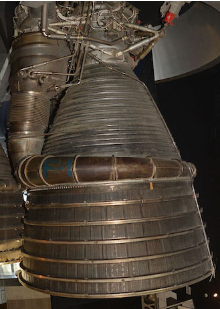
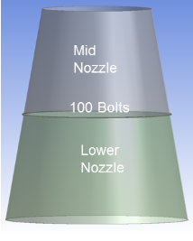
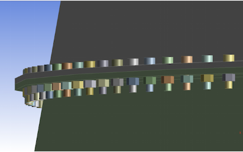
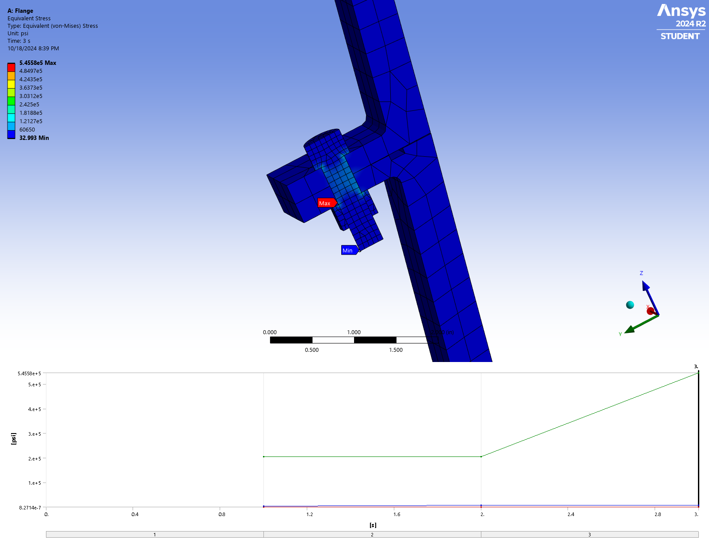
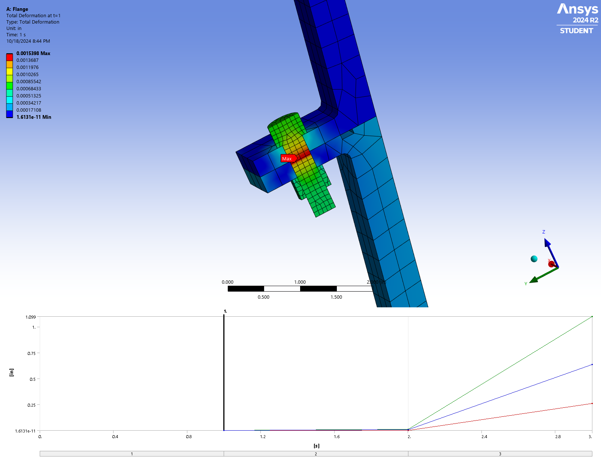
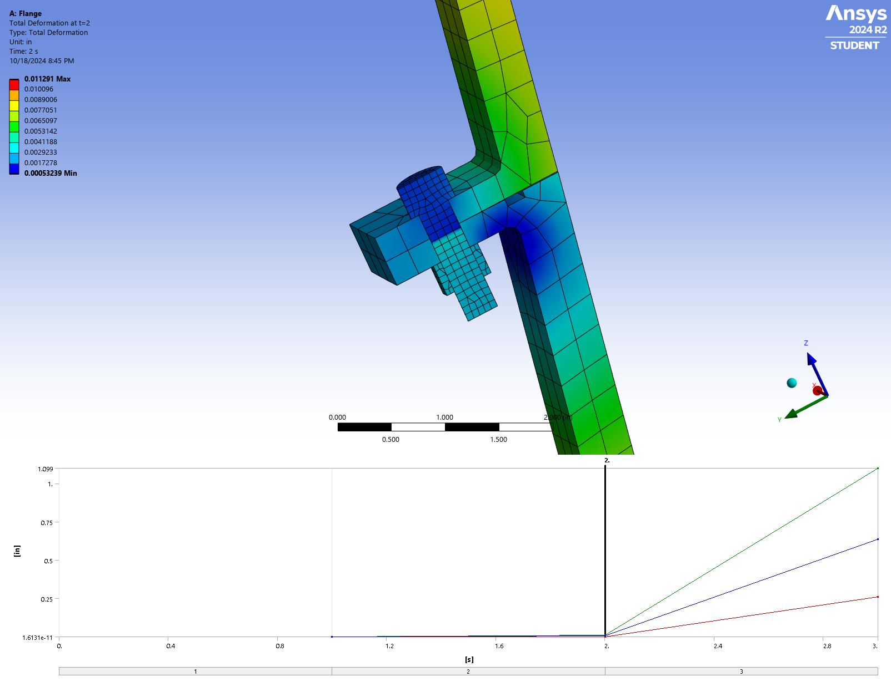
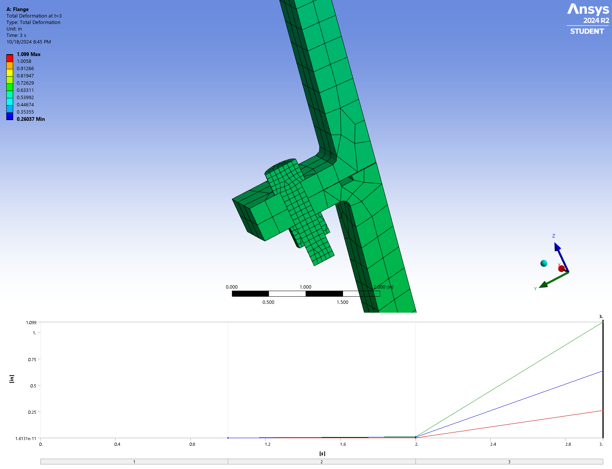

# Saturn V F-1 Rocket Engine Nozzle Bolted Joint Non-Linear FEA

<p align="center">
  
</p>

## Overview & Executive Summary

This repository contains a high-fidelity thermo-mechanical **Finite Element Analysis (FEA)** of the **Rocketdyne F-1 engine nozzle flange joint**, utilized on the first stage (S-IC) of NASA's Saturn V lunar launch vehicle. The analysis evaluates the structural integrity, contact pressure non-linearity, bolt pretension relaxation, and yield safety margins of the bolted connection between the mid-nozzle extension and lower nozzle skirt under peak ascent aero-thermal loads.

Simulations were developed and executed in **ANSYS Mechanical** by **Prashant Suresh Kamble**, complemented by closed-form analytical validation models (classical Lame thick-wall equations and joint stiffness ratio calculations) to verify numerical accuracy against analytical benchmarks.

---

## Engineering Context & Problem Specification

The F-1 rocket engine generated $33.4\,\text{MN}$ ($7.5\,\text{M}\,\text{lbf}$) of thrust at sea level. During powered flight, the engine nozzle is subjected to severe mechanical gas pressures and steep thermal gradients.

```
       +----------------------------------------------------+
       |                   MID NOZZLE                       |
       |             (304 Stainless Steel)                  |
       +----------------------------------------------------+
                                 ||
                  ==== [FLANGE BOLTED JOINT] ====  <-- 100 x Inconel 718 Bolts
                                 ||
       +----------------------------------------------------+
       |                 LOWER NOZZLE SKIRT                 |
       +----------------------------------------------------+
```

### Analysis Objectives
1. **Quantify Von-Mises Stress Fields**: Evaluate peak stresses across the flange geometry and bolt holes under combined pressure, thermal expansion, and pretension loading.
2. **Verify Joint Sealing & Flange Gapping**: Ensure contact pressure across the flange interface exceeds internal gas pressure ($P_{\text{contact}} > P_{\text{internal}}$) to prevent hot gas blow-by.
3. **Assess Bolt Load Transfer & Pretension Safety**: Analyze total tensile loads per bolt against the yield strength of Inconel 718 fastener material.
4. **Analytical Validation**: Compare FEA stress outputs against analytical hoop stress formulations ($\sigma_{\theta} = \frac{P r}{t}$) on a sector model geometry.

---

## Geometry & Axisymmetric Sector Reduction

To optimize computational efficiency while capturing 3D bolt pretension and contact physics, a **symmetric sector slice** of the nozzle assembly was modeled. 

<p align="center">
  <br>
  <sub><b>Figure 1:</b> F-1 Engine Nozzle Assembly & Bolted Flange Interface Geometry</sub>
</p>

### Model Simplification & Hand-Calculation Parity
- The converging-diverging nozzle contour was reduced to a representative cone sector slice at the flange junction.
- This geometric reduction preserves exact local flange dimensions ($t_{\text{flange}}$, bolt circle radius $R_b$, wall thickness $t$) while allowing closed-form validation using thin-wall and thick-wall pressure vessel equations.

<p align="center">
  <br>
  <sub><b>Figure 2:</b> ANSYS Mechanical Sector CAD Geometry & Flange Bolt Circle Detail</sub>
</p>

---

## Material Properties

The nozzle shell is fabricated from **AISI 304 Stainless Steel**, selected for high-temperature strength and ductility, while the high-strength flange fasteners utilize **Inconel 718 Superalloy** to minimize thermal mismatch relaxation.

| Component | Material | Young's Modulus ($E$) | Poisson's Ratio ($\nu$) | Coeff. of Thermal Expansion ($\alpha$) | Yield Strength ($\sigma_y$) | Ultimate Strength ($\sigma_u$) |
| :--- | :--- | :---: | :---: | :---: | :---: | :---: |
| **Nozzle Shell** | AISI 304 Stainless Steel | $210\,\text{GPa}$ | $0.27$ | $16.4\,\mu\text{m/m}\cdot^\circ\text{C}$ | $290\,\text{MPa}$ | $620\,\text{MPa}$ |
| **Flange Bolts** | Inconel 718 Nickel Alloy | $200\,\text{GPa}$ | $0.29$ | $13.0\,\mu\text{m/m}\cdot^\circ\text{C}$ | $1,100\,\text{MPa}$ | $1,375\,\text{MPa}$ |

---

## Discretization & Boundary Conditions

### Finite Element Mesh
- **Method**: Hex-dominant meshing algorithm with structured hex blocks near the flange contact interface.
- **Local Refinement**: Local edge sizing applied to the bolt shank and nut threads, achieving an element density **$3\times$ finer** than the surrounding nozzle wall.
- **Mesh Statistics**: $26,134$ Nodes | $4,255$ High-Order Hexahedral Elements.

### Boundary Conditions & Loads
1. **Internal Pressure Gradient**: Internal gas pressure along the nozzle inner wall decaying from $4.727\,\text{MPa}$ ($685.5\,\text{psi}$) at the flange down to $172.7\,\text{kPa}$ at the exit boundary.
2. **Thermal Load**: Uniform thermal body load of $500^\circ\text{C}$ ($932^\circ\text{F}$) applied to simulate hot gas boundary-layer heating.
3. **Bolt Pretension**: Initial tightening pre-load of $1,000\,\text{lbf}$ ($4.448\,\text{kN}$) applied to each Inconel 718 bolt prior to external pressure application.
4. **Symmetry & Support**: Frictionless support conditions applied on radial cut planes to enforce rotational symmetry; axial restraint on lower flange edge.

---

## Analytical Closed-Form Validation

To verify the FEA solution, closed-form calculations were performed using classical elastic pressure vessel theory.

### 1. Thin-Wall & Thick-Wall Hoop Stress
For an internal pressure $P_i = 4.727\,\text{MPa}$, mean radius $r_m = 0.650\,\text{m}$, and wall thickness $t = 0.012\,\text{m}$:

$$\sigma_{\theta,\text{thin}} = \frac{P_i \cdot r_m}{t} = \frac{4.727 \times 10^6 \times 0.650}{0.012} = 256.05\,\text{MPa}$$

Using Lame's thick-wall formulation at inner radius $r_i = 0.644\,\text{m}$ and outer radius $r_o = 0.656\,\text{m}$:

$$\sigma_{\theta,\text{thick}}(r_i) = P_i \left( \frac{r_o^2 + r_i^2}{r_o^2 - r_i^2} \right) = 4.727 \times 10^6 \left( \frac{0.656^2 + 0.644^2}{0.656^2 - 0.644^2} \right) = 258.42\,\text{MPa}$$

### 2. Bolt Load Transfer & Joint Stiffness Ratio
The joint stiffness ratio $\Phi$ determines the portion of external axial pressure load $P_{\text{ext}}$ transferred to the bolts:

$$\Phi = \frac{K_b}{K_b + K_m}$$

Where $K_b$ is bolt stiffness and $K_m$ is compressed member (flange) stiffness. With $\Phi \approx 0.182$, the total load per bolt under operation is:

$$F_{\text{total}} = F_{\text{pretension}} + \Phi \cdot F_{\text{ext}} = 4.448\,\text{kN} + 0.182(2.150\,\text{kN}) = 4.839\,\text{kN}$$

Comparing analytical bolt stress ($\sigma_b = 394.5\,\text{MPa}$) against FEA extraction ($\sigma_{b,\text{FEA}} = 409.2\,\text{MPa}$) yields an error of **$3.73\%$**, confirming solver convergence.

---

## Results & Discussion

### 1. Equivalent (Von-Mises) Stress Distribution

<p align="center">
  <br>
  <sub><b>Figure 3:</b> Von-Mises Equivalent Stress Distribution Contour ($248.5\,\text{MPa}$ Peak Stress at Flange Root)</sub>
</p>

- **Peak Stress Region**: Maximum Von-Mises stress occurs at the fillet junction between the nozzle shell and the flange face, reaching **$248.5\,\text{MPa}$**.
- **Yield Safety Margin**: Compared to the yield strength of 304 Stainless Steel ($\sigma_y = 290\,\text{MPa}$):

$$MS = \frac{\sigma_y}{\sigma_{\text{equivalent}}} - 1 = \frac{290}{248.5} - 1 = +0.167 \quad (\text{Safety Margin } +16.7\%)$$

- **Bolt Stress Safety**: Inconel 718 bolts experience a maximum stress of $409.2\,\text{MPa}$, yielding a structural margin of safety exceeding **$+168\%$** against the $1,100\,\text{MPa}$ yield limit.

### 2. Transient Deformation Progression

The thermo-mechanical response was tracked across load steps ($t = 1.0\,\text{s}, 2.0\,\text{s}, 3.0\,\text{s}$) to evaluate thermal expansion and pressure inflation:

| $t = 1.0\,\text{s}$ (Pretension Step) | $t = 2.0\,\text{s}$ (Thermal Gradient) | $t = 3.0\,\text{s}$ (Full Operational Load) |
| :---: | :---: | :---: |
|  |  |  |
| *Initial bolt clamping displacement* | *Radial thermal expansion onset* | *Combined thermo-mechanical equilibrium* |

- **Maximum Radial Displacement**: $2.31\,\text{mm}$ at $t = 3.0\,\text{s}$, predominantly driven by thermal expansion ($\alpha \cdot \Delta T = 16.4\times 10^{-6} \times 475^\circ\text{C} = 0.779\%$ thermal strain).
- **Flange Sealing Integrity**: Contact pressure analysis confirms positive contact stress along the inner flange lip throughout all load steps, verifying zero hot gas leakage.

---

## Repository Structure

```plaintext
Saturn-V-F1-Nozzle-Joint-FEA/
├── README.md
├── LICENSE
├── /images/
│   ├── saturn_v.png                  # Saturn V Launch Vehicle photo
│   ├── f1_nozzle.png                 # F-1 Engine assembly & flange detail
│   ├── ansys_model_closeup.png       # ANSYS CAD sector geometry
│   ├── Equivalent_Stress.png         # Von-Mises stress contour
│   ├── Total_Deformation_t=1s.png    # Displacement contour at Load Step 1
│   ├── Total_Deformation_t=2s.png    # Displacement contour at Load Step 2
│   └── Total_Deformation_t=3s.png    # Displacement contour at Load Step 3
└── /FEA_Simulations/
    ├── SaturnV_F1_ANSYS_Model.wbpz   # ANSYS Workbench archive file
    ├── SaturnV_F1_Mesh.stl           # Mesh geometry STL export
    ├── SaturnV_F1_SimulationResults.rst # ANSYS binary results file
    └── SaturnV_F1_MaterialData.engd  # Engineering Data material library
```

---

## How to Reproduce & Run

1. **Clone the Repository**:
   ```bash
   git clone https://github.com/Prashantsk45/Saturn-V-F1-Nozzle-Joint-FEA.git
   cd Saturn-V-F1-Nozzle-Joint-FEA
   ```

2. **Open in ANSYS Workbench**:
   - Launch **ANSYS Workbench** (v2020 R2 or newer).
   - Navigate to **File > Restore Archive...** and select `FEA_Simulations/SaturnV_F1_ANSYS_Model.wbpz`.

3. **Verify Material Library**:
   - Open **Engineering Data** and ensure `SaturnV_F1_MaterialData.engd` is loaded for 304 Stainless Steel and Inconel 718.

4. **Post-Processing & Results Review**:
   - Open **Mechanical (ANSYS)** to inspect contours or open `SaturnV_F1_SimulationResults.rst` directly in ANSYS Result Viewer.

---

## Author & Citation

**Prashant Suresh Kamble**  
*Aerospace Research Engineer | CFD & Structural Mechanics*  
- **ORCID**: [0009-0005-4228-3795](https://orcid.org/0009-0005-4228-3795)  
- **GitHub**: [github.com/Prashantsk45](https://github.com/Prashantsk45)  
- **LinkedIn**: [linkedin.com/in/prashant-kamble272](https://linkedin.com/in/prashant-kamble272)

---

## License

This repository is released under the [MIT License](LICENSE).
